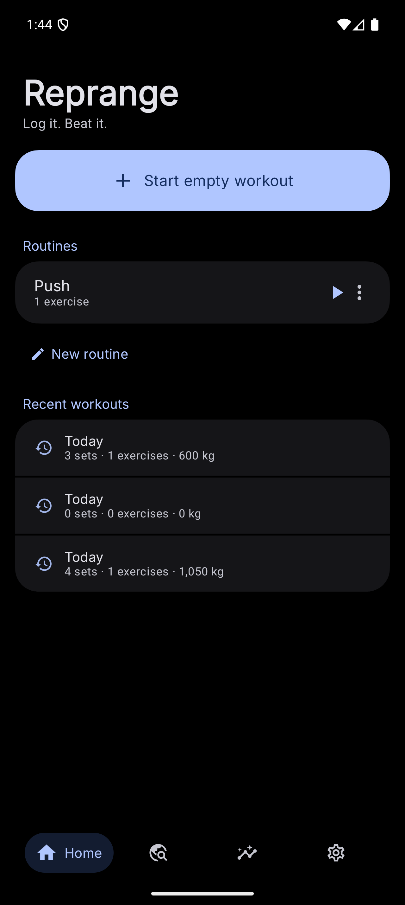
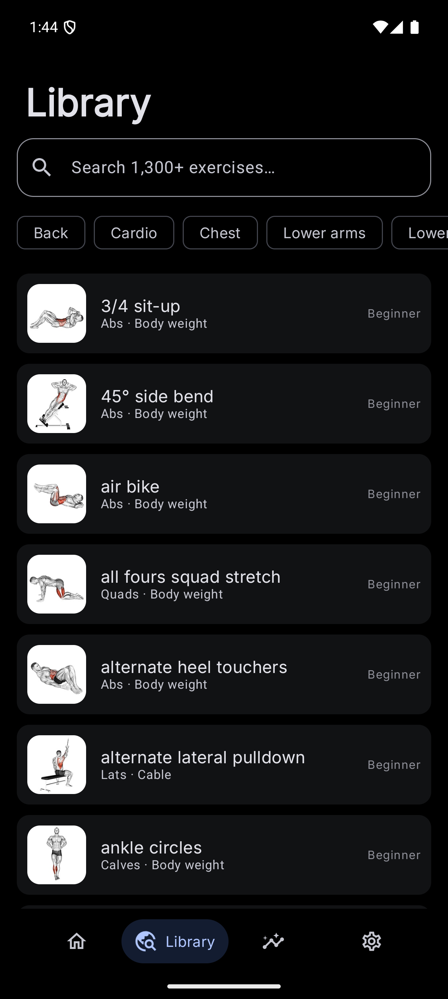
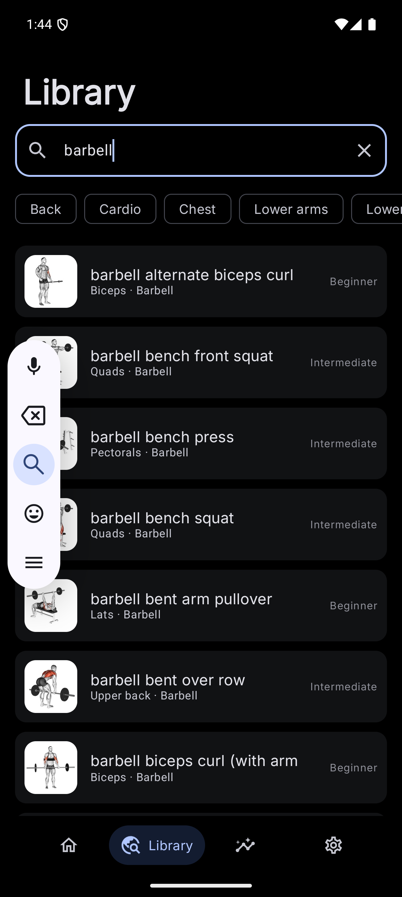
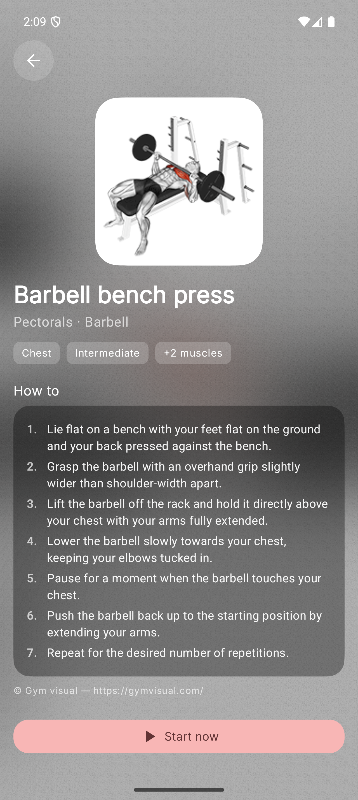
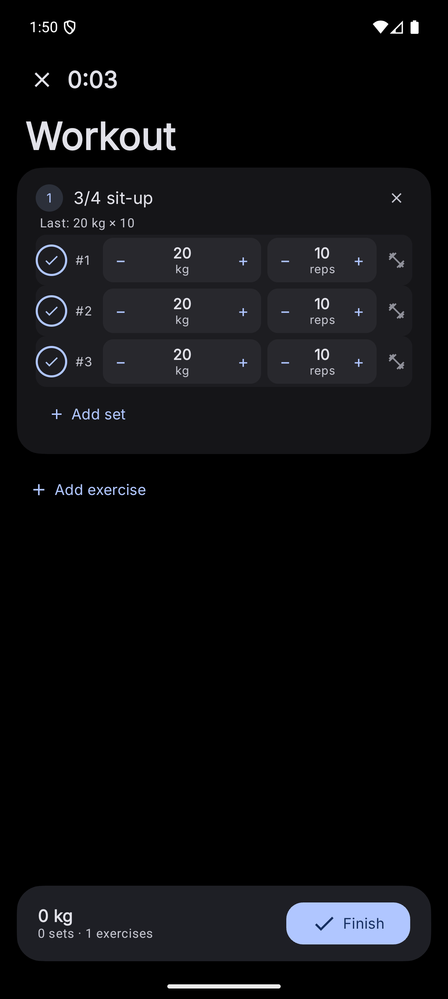
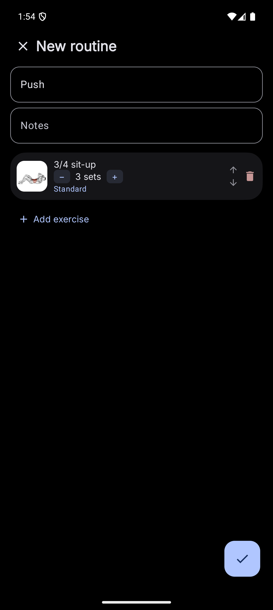
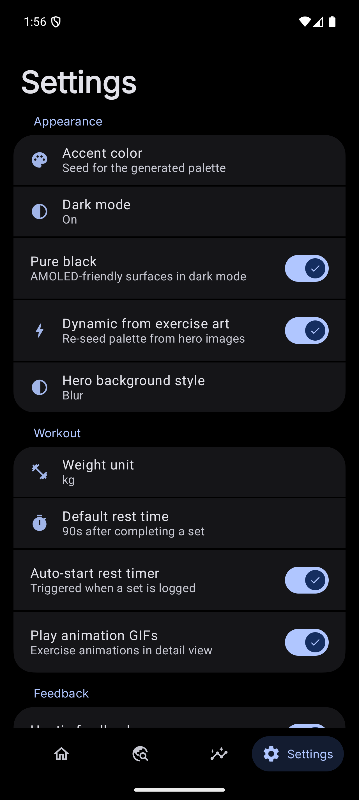
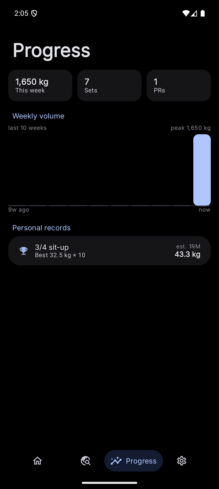
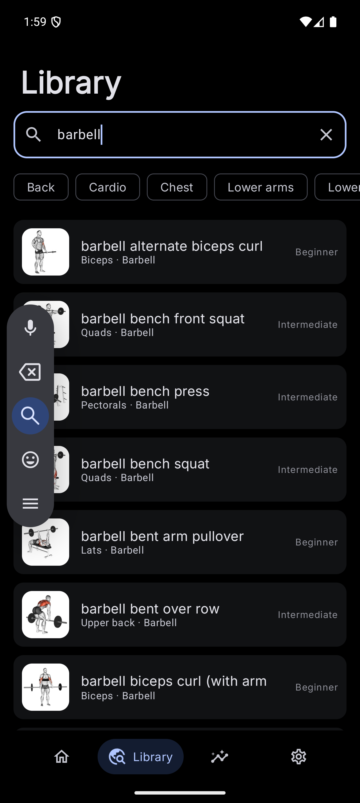
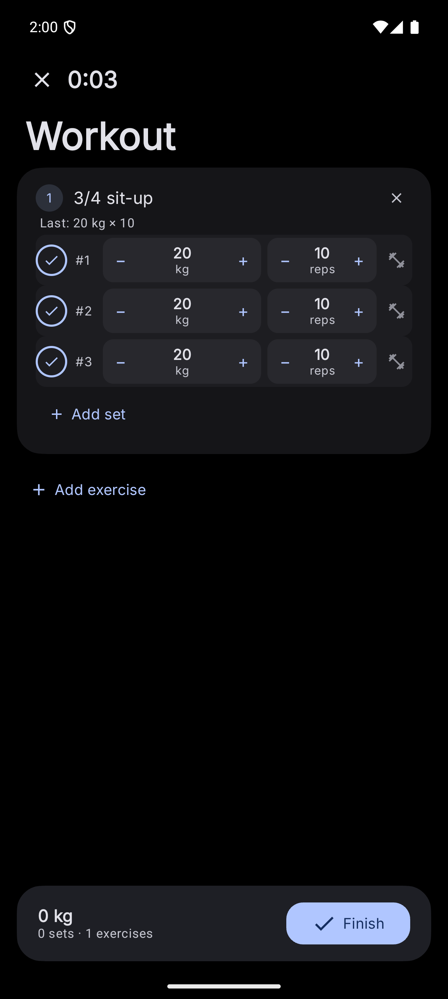

<p align="center">
  <h1 align="center">🏋️ Reprange</h1>
  <p align="center"><i>Log it. Beat it.</i></p>
  <p align="center">A fast, keyboard-free workout tracker for Android — built with Jetpack Compose and Material 3 Expressive.</p>
</p>

---

Reprange is a native Android workout logging app designed for the gym: big tap targets,
no keyboard in the common path, automatic rest timers, and a 1,324-exercise library with
animations. Dark-theme first, fully edge-to-edge, and themed by Material You.

## Screenshots

| | | |
|---|---|---|
|  |  |  |
| *Home — start in one tap* | *Library — 1,324 exercises* | *Full-text search* |
|  |  |  |
| *Exercise detail hero* | *Active workout — stepper rows* | *Routine builder* |
|  |  |  |
| *Progress & PRs* | *Settings* | *Dark mode* |

<p align="center">
    
</p>
<p align="center"><i>Dark theme: progress, exercise detail, active workout</i></p>

## Features

### 🏋️ Frictionless workout logging
- **Stepper set rows** — ±2.5 kg / ±1 rep in one tap; tap a value for fine input.
  Values pre-fill from your last session, so a typical set is **one tap on ✓**
- **Set types per row** — tap the row icon to cycle Normal 🏋️ / Warmup 🔥 / Drop set 📉 / Failure ⚡
- **Planned sets** — start a saved routine and its sets appear as pre-filled rows
  (targets included); completed rows flip to logged, `Add set` duplicates the last one
- **Auto rest timer** — starts when a Normal set is logged; +15 s / skip from the top bar
- **PR detection** — every logged set is compared against your history (Epley estimated
  1RM); new records trigger a celebration haptic + snackbar
- Swipe-to-delete on logged sets; elapsed timer and live volume totals
- **Superset grouping** — consecutive `SUPER_SET` exercises sharing a group show a
  `Superset X` label; a **Next Up** indicator alternates within the group
  (wrapping A→B→A) or points at the next exercise, and hides on the last one

### 📋 Plan ahead (routines)
- Build routines once (name, notes, exercises, sets, set strategy) and start them in one tap
- Set strategies: **Standard, Step-up (pyramid — auto-escalates +2.5 kg per set),
  Drop set, Super set, Failure**

### 🧭 Onboarding (recommended routines)
- Optional 5-question wizard (goal, experience, equipment, days/week 2–6, split);
  never a gate — entry is a Home card plus a *Settings → Personalize routines* row
- Splits are filtered by days (`Full body` 2–6, `Upper / Lower` 4+, `Push / Pull / Legs`
  3+); changing days auto-resets an invalid split
- Generates 1–6 personalized routines from the exercise dataset (1 Full body,
  2 Upper/Lower, 3 PPL — 6 on a six-day PPL repeat), equipment- and
  difficulty-filtered with a one-tier fallback and cross-bucket dedup,
  with per-goal sets/reps/rest (e.g. Strength 4×5/90 s, Fat loss 3×12–15/60 s)
- **Preview before saving**: tabbed per-template preview where tapping a row swaps
  the exercise via a picker pre-filtered to that row's muscle bucket; batch-saves
  with one tap, or Skip with nothing written
- **Six-day PPL repeat**: 6 days of Push/Pull/Legs generates two cycles —
  `Push A` / `Pull A` / `Legs A` / `Push B` / `Pull B` / `Legs B` — preferring
  unused exercises for cycle B and reusing cycle-A picks per bucket when the pool
  runs out

### 📚 Exercise library
- **1,324 exercises** ingested at first launch from the
  [hasaneyldrm/exercises-dataset](https://github.com/hasaneyldrm/exercises-dataset)
  (Retrofit + kotlinx.serialization → Room)
- Full-text search (Room FTS4) across name, target, and equipment
- Filters by body part, difficulty, and **equipment** (chips with a clear affordance);
  every exercise has an animation GIF,
  targeted muscles, equipment, and step-by-step instructions
- Exercise detail is a **hero surface**: the artwork drives a dynamic gradient
  background and (optionally) re-seeds the entire app palette live

### 📈 Progress
- Weekly volume chart (last 10 rolling weeks), weekly sets, PR count
- **1RM-over-time chart** — pick any PR exercise to see its best estimated 1RM per
  day over the last 90 days (auto-selects your top PR)
- Personal-record table with best set and estimated 1RM per exercise

### 🎨 Material 3 Expressive
- `MaterialExpressiveTheme` + expressive motion scheme; smooth-corner squircles
- Three-tier color seeding: **wallpaper (Monet) → 19 preset accents → content-derived
  live seeding** from exercise artwork; pure-black AMOLED mode
- Dynamic hero backgrounds (gradient / glow / blur / layered / mesh) with adaptive
  foregrounds and status-bar icon flipping
- Tiered haptic feedback (primitive compositions → predefined effects → view constants)
  behind a single `AppHaptics` choke point, with an in-app toggle

## Tech stack

| Layer | Choice |
|---|---|
| Language | 100% Kotlin |
| UI | Jetpack Compose, **Material 3 `1.5.0-alpha23`** (Expressive), Coil 3 (GIFs), Haze, Palette, materialKolor |
| Architecture | Clean Architecture + MVVM (ViewModels, use cases, repository layer) |
| Data | Room (FTS4 search, relations, cascades), DataStore preferences |
| Networking | Retrofit + OkHttp + kotlinx.serialization (dataset ingest & seeding) |
| DI | Hilt |
| Navigation | Compose Navigation with type-safe routes |
| Build | AGP 9.2.1 · Gradle 9.4.1 · Kotlin 2.3.21 (min SDK 26, target 37) |

## Architecture

```
app/src/main/kotlin/com/deepkush/reprange/
├── data/
│   ├── db/          # Room: entities, FTS index, DAOs, relations
│   ├── remote/      # Retrofit API + DTOs for the exercises dataset
│   └── repo/        # Repositories + first-launch dataset seeder
├── domain/usecase/  # CreateWorkoutPlan, StartSession, LogCompletedSet,
│                    # CalculateProgress (volume buckets, Epley 1RM, PRs)
├── domain/onboarding/ # Profile (goal/experience/equipment/days/split),
│                    # GoalConfig, pure OnboardingRecommender (JVM-testable)
├── workout/         # ActiveSessionManager: live session + rest timer,
│                     # survives navigation & process death (Room-backed)
├── di/              # Hilt modules (database, network)
├── ui/
│   ├── theme/       # AppTheme (hybrid seeding), Type, ColorExtractor
│   ├── component/   # Dynamic background engine, sheet host, dialogs,
│   │                # settings groups, bottom bar, session dock
│   └── screens/     # home · library · exercise · workout · template ·
│                    # progress · settings · onboarding
└── utils/           # AppHaptics, DataStore prefs, shapes, formatters
```

## How it works

- **Search** — Room FTS4 external-content index over `name / category / target /
  equipment`, prefix queries (`barbell*`), joined back on `rowid`
- **Weekly volume** — Σ(weight × reps) of Normal sets from finished sessions,
  bucketed into the last 10 rolling 7-day windows
- **Estimated 1RM** — Epley: `weight × (1 + reps / 30)`; PRs compare a weighted
  1RM + volume score against the exercise's history
- **Live session** — an unfinished session is persisted with `ended_at = NULL`,
  so it survives process death and re-attaches on next launch (mini-dock above
  the nav bar)
- **Onboarding picks** — per muscle-bucket queries (`target` aliases +
  `equipment IN allowed` + `difficulty <= max`, `ORDER BY name`) with unused-first
  dedup, one-tier difficulty fallback, and compound-lift `STEP_UP` for
  non-beginners; templates are written through the unchanged `CreateWorkoutPlan` path

## Build & run

```bash
# Requirements: Android Studio (Narwhal+), JDK 17+, Android SDK 37
git clone <this-repo>
cd Reprange
./gradlew :app:assembleDebug
# or open in Android Studio and press Run
```

First launch fetches the exercise dataset over the network (a few MB) and seeds
the local database — an error banner with retry appears if offline.

## Dataset & media attribution

- Exercise metadata, translations, and structure:
  [hasaneyldrm/exercises-dataset](https://github.com/hasaneyldrm/exercises-dataset) — MIT
- Exercise thumbnails & animation GIFs: **© [Gym visual](https://gymvisual.com/)**,
  redistributed via that dataset under its media terms; attribution is shown
  on every exercise detail screen

## License

App code: MIT. Third-party media terms apply as noted above.
